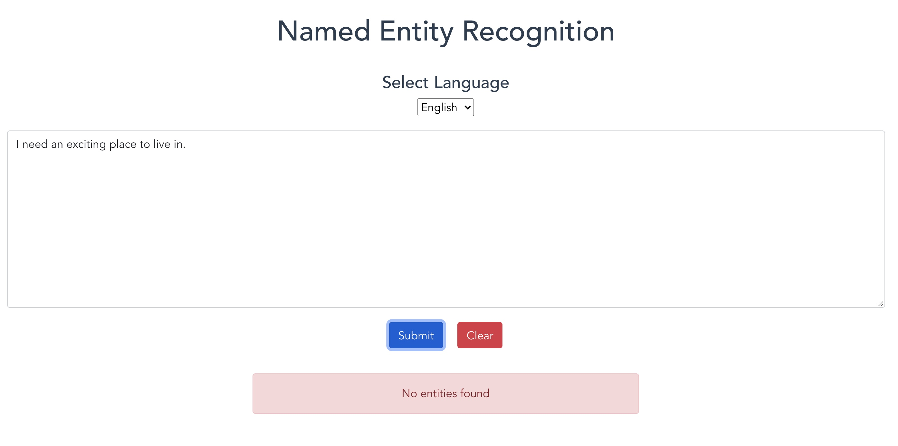
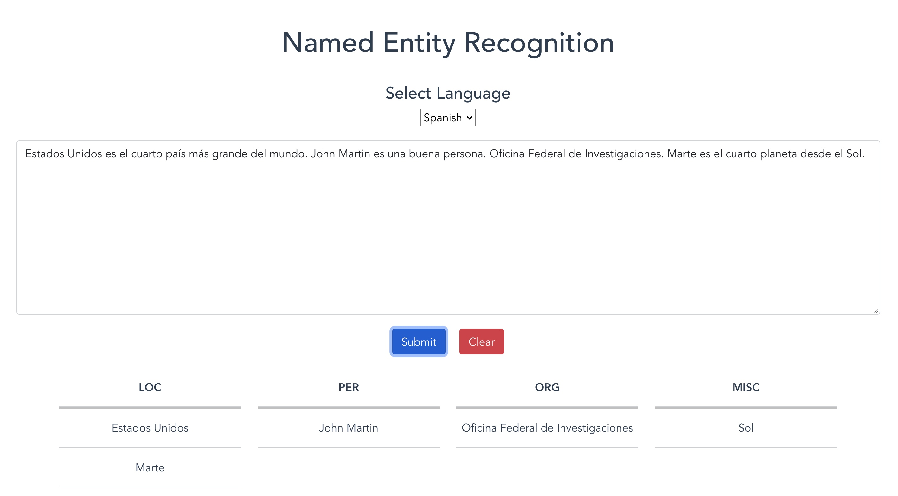
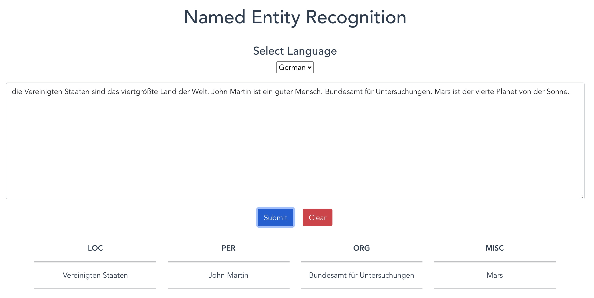

# Web-based named entity recognition

This project is done using Vue.js as frontend and Flask as backend. In this project, Named Entity Recognition (NER) is done using spaCy and the user can select upto 4 different languages.

The spaCy model categorizes into different entitities like:
1. PERSON
2. GPE (Geopolitical Entity)
3. LOC (Location)
4. ORG (Organization)
5. MONEY 
6. DATE
7. EVENT
8. WORK_OF_ART 
9. LANGUAGE
10. TIME
11. QUANTITY
12. PERCENT
13. CARDINAL (Numerals)
14. ORDINAL
15. NORP (Nationalities or religious or political groups)
16. FAC (Buildings, airports, bridges)

## Steps to run the project
1. Clone the repository.
2. Run `cd web-ner-challenge; make install FRONTEND=vue-frontend BACKEND=flask-backend`.
3. Run the following to install few requirements.
```
cd vue-frontend
npm install vue bootstrap bootstrap-vue
npm install axios --save
cd ..
python3 -m spacy download en_core_web_sm
python3 -m spacy download fr_core_news_sm
python3 -m spacy download de_core_news_sm
python3 -m spacy download es_core_news_sm
pip3 install spacy
```
4. Run `make start FRONTEND=vue-frontend BACKEND=flask-backend`.

## Screenshots

||
|:--:| 
| *English NER* |

||
|:--:| 
| *No entities found* |

||
|:--:| 
| *Spanish NER* |

||
|:--:| 
| *German NER* |


## References

- [spaCy](https://spacy.io/models/en)
- [NER with spaCy](https://towardsdatascience.com/named-entity-recognition-with-nltk-and-spacy-8c4a7d88e7da)
- [Vue.js Crash Course](https://www.youtube.com/watch?v=qZXt1Aom3Cs)
